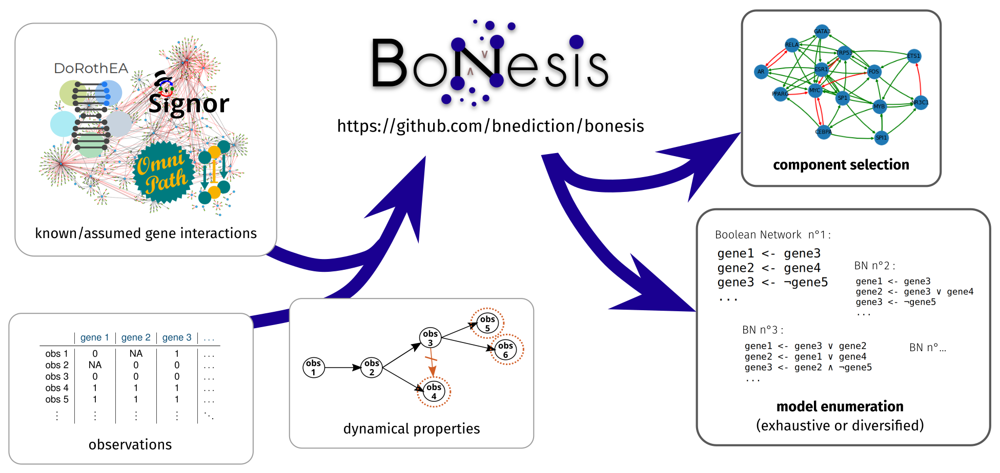

# notebooks_for_bonesis
temporary folder for sharing notebooks to guide the use of bonesis

In the "tutorials" folder, notebooks for helping the the general steps of:
* **the prior knowledge network preprocessing**
* **the observations preprocessing**

In the "applications/hematopoiesis" folder:
* `A_components-selection`: the notebook used **for getting the logic program given to clingo for the component selection** for our hematopoiesis application

--
